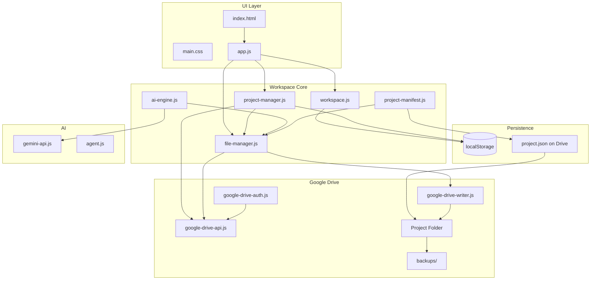

# Folder Agent — Architecture & Audit Report

## Executive Summary

Folder Agent has been transformed from a partial file-generator prototype into a **persistent AI development workspace** with Google Drive as primary storage, per-project isolation, and VS Code-style UI.

---

## 1. Bug Report

| # | Severity | Bug | Status |
|---|----------|-----|--------|
| 1 | Critical | New Drive folder created on every Gemini prompt | **Fixed** — folder created once at project creation |
| 2 | Critical | Global `drive_folder_id` shared across all projects | **Fixed** — `folderId` stored per project |
| 3 | Critical | `projectSummary.textContent` ReferenceError in agent.js | **Fixed** — context builder rewritten |
| 4 | High | `logPromptSent()` called before early return on missing API key | **Fixed** — logging order corrected |
| 5 | High | Scan always fails without local folder path | **Fixed** — Drive-based scan implemented |
| 6 | High | Duplicate files on re-upload (`createDriveFile` only) | **Fixed** — `createOrUpdateFile()` upsert |
| 7 | High | Gemini API key not restored on page load | **Fixed** — restored from project settings + global key |
| 8 | Medium | Hardcoded "Google Drive Connected" without check | **Fixed** — real connection status badge |
| 9 | Medium | `createProjectFiles()` side effect on every page load | **Fixed** — legacy `file-writer.js` removed from load |
| 10 | Medium | No Drive API error handling | **Fixed** — `driveFetch()` wrapper with error checks |
| 11 | Medium | Chat history lost on refresh | **Fixed** — per-project `chatHistory` in storage + manifest |
| 12 | Medium | Activity log global, no UI | **Fixed** — per-project logs with live UI panel |
| 13 | Low | No delete project UI | **Fixed** — Delete Project button with full cleanup |
| 14 | Low | No file explorer or editor | **Fixed** — VS Code-style explorer + editor |
| 15 | Low | No preview system | **Fixed** — iframe preview with inlined CSS/JS |

---

## 2. Root Cause Analysis

### RCA-1: Duplicate Drive Folders
**Cause:** `handleGeminiPrompt()` called `createProjectDriveFolder()` on every prompt instead of reusing the project's folder.

**Fix:** `createProject()` in `project-manager.js` creates the Drive folder once, stores `folderId` on the project record, and all operations use that ID.

### RCA-2: Local vs Drive Workflow Conflict
**Cause:** Mid-migration codebase retained `folder-access.js`, `real-folder-access.js`, and `file-writer.js` alongside Drive modules.

**Fix:** Removed legacy scripts from `index.html`. All file operations now go through `file-manager.js` → Google Drive API.

### RCA-3: No Update Path for Files
**Cause:** Only `createDriveFile()` was wired; `updateDriveFile()` existed but was never called.

**Fix:** `createOrUpdateFile()` finds existing files by name, backs up, then updates or creates.

### RCA-4: Shallow Persistence
**Cause:** Only project list and last-opened ID persisted. Generated files, chat, settings lived in memory.

**Fix:** Extended project schema with `settings`, `chatHistory`, `buildHistory`, `workspaceState`, `fileIds`. `project.json` synced to Drive as manifest.

### RCA-5: Agent Context Crash
**Cause:** `agent.js` referenced DOM element `projectSummary` from `app.js` module scope.

**Fix:** `buildAgentContext()` now receives structured data parameters instead of DOM references.

---

## 3. Files Modified

| File | Change |
|------|--------|
| `index.html` | Full workspace UI: explorer, editor, chat, preview, delete |
| `css/main.css` | VS Code-style dark theme layout |
| `js/app.js` | Complete rewrite as UI orchestrator |
| `js/storage.js` | Extended project schema, `findProjectByName()` |
| `js/workspace.js` | **New** — state, persistence, chat, settings |
| `js/project-manager.js` | **New** — create/open/delete/scan |
| `js/file-manager.js` | **New** — createOrUpdate, backup, file tree |
| `js/project-manifest.js` | **New** — project.json sync |
| `js/ai-engine.js` | **New** — NLP intent → file updates |
| `js/publish.js` | **New** — GitHub Pages architecture stub |
| `js/google-drive-api.js` | read, find, subfolder, trash, error handling |
| `js/google-drive-writer.js` | Per-project folder, `createDriveFileInFolder` |
| `js/google-drive-auth.js` | Token restore on load |
| `js/activity-log.js` | Per-project logs + UI rendering |
| `js/agent.js` | Fixed context builder |
| `js/folder-scanner.js` | Drive-based scan delegation |
| `js/project-reopen.js` | Removed local folder dependency |

**Removed from load chain:** `folder-access.js`, `real-folder-access.js`, `file-writer.js`, `project-builder.js` (files remain on disk but are not used).

---

## 4. Exact Changes (Core Functions)

```
createProject(name)
  → findProjectByName() — prevent duplicates
  → ensureDriveConnection()
  → createDriveFolder("FolderAgent_{name}")
  → createProjectRecord({ folderId, settings, ... })
  → initializeProjectFiles() — index.html, style.css, app.js
  → syncManifestToDrive()
  → openProject()

openProject(project)
  → setCurrentProject(), setDriveFolderId(project.folderId)
  → mergeManifestWithProject()
  → restoreWorkspace() — settings, chat, activity logs
  → refreshFileExplorer()

createOrUpdateFile(folderId, fileName, content, ...)
  → findFileInFolder()
  → if exists: createBackup() → updateDriveFile()
  → else: createDriveFileInFolder()

processNaturalLanguageRequest(prompt, project)
  → readProjectFiles() — read all current content
  → sendToGemini() — JSON response with file changes
  → createOrUpdateFile() for each changed file
  → syncManifestToDrive()

deleteProject(id)
  → trashDriveFolder()
  → clearProjectActivityLogs()
  → deleteProjectRecord()
```

---

## 5. Final Architecture Diagram



### Project Folder Structure (Google Drive)

```
FolderAgent_{ProjectName}/
├── index.html
├── style.css
├── app.js
├── project.json          ← manifest (fileIds, settings, chat, build history)
└── backups/
    ├── index-v1.html
    ├── style-v1.css
    └── ...
```

### Data Model (per project in localStorage)

```json
{
  "id": "timestamp",
  "name": "My Website",
  "folderId": "drive-folder-id",
  "backupsFolderId": "backups-folder-id",
  "fileIds": { "index.html": "file-id", "style.css": "file-id" },
  "settings": { "geminiApiKey": "", "selectedModel": "gemini-2.0-flash" },
  "chatHistory": [{ "role": "user", "content": "...", "time": "10:20" }],
  "buildHistory": [{ "file": "style.css", "action": "updated" }],
  "workspaceState": { "openFile": "style.css", "fileTree": [] }
}
```

---

## 6. Feature Compliance Matrix

| Requirement | Status |
|-------------|--------|
| One Project = One Drive Folder | ✅ |
| Never duplicate project folders | ✅ |
| Never duplicate files | ✅ |
| Read before write | ✅ |
| createOrUpdateFile | ✅ |
| Backup before update | ✅ |
| project.json manifest | ✅ |
| Per-project chat history | ✅ |
| Per-project API keys | ✅ |
| Refresh persistence | ✅ |
| VS Code explorer | ✅ |
| File editor + save | ✅ |
| Natural language (Hindi/English/Hinglish) | ✅ via Gemini |
| Scan Project (Drive) | ✅ |
| Activity log | ✅ |
| Preview website | ✅ |
| Delete project | ✅ |
| Publish architecture (GitHub Pages) | ✅ stub ready |
| Local path workflow removed | ✅ |

---

## 7. Usage Flow

1. **Connect Google Drive** — OAuth once, token persists
2. **Create Project** — creates Drive folder + default files + opens workspace
3. **Chat** — "Background red kar do" → AI updates `style.css` with backup
4. **Explorer** — browse files, click to edit, save to Drive
5. **Scan** — refresh file tree from Drive
6. **Preview** — render website in iframe
7. **Refresh page** — project, chat, settings, last file restored
8. **Switch projects** — isolated chat, settings, folder per project
9. **Delete** — removes metadata + trashes Drive folder
